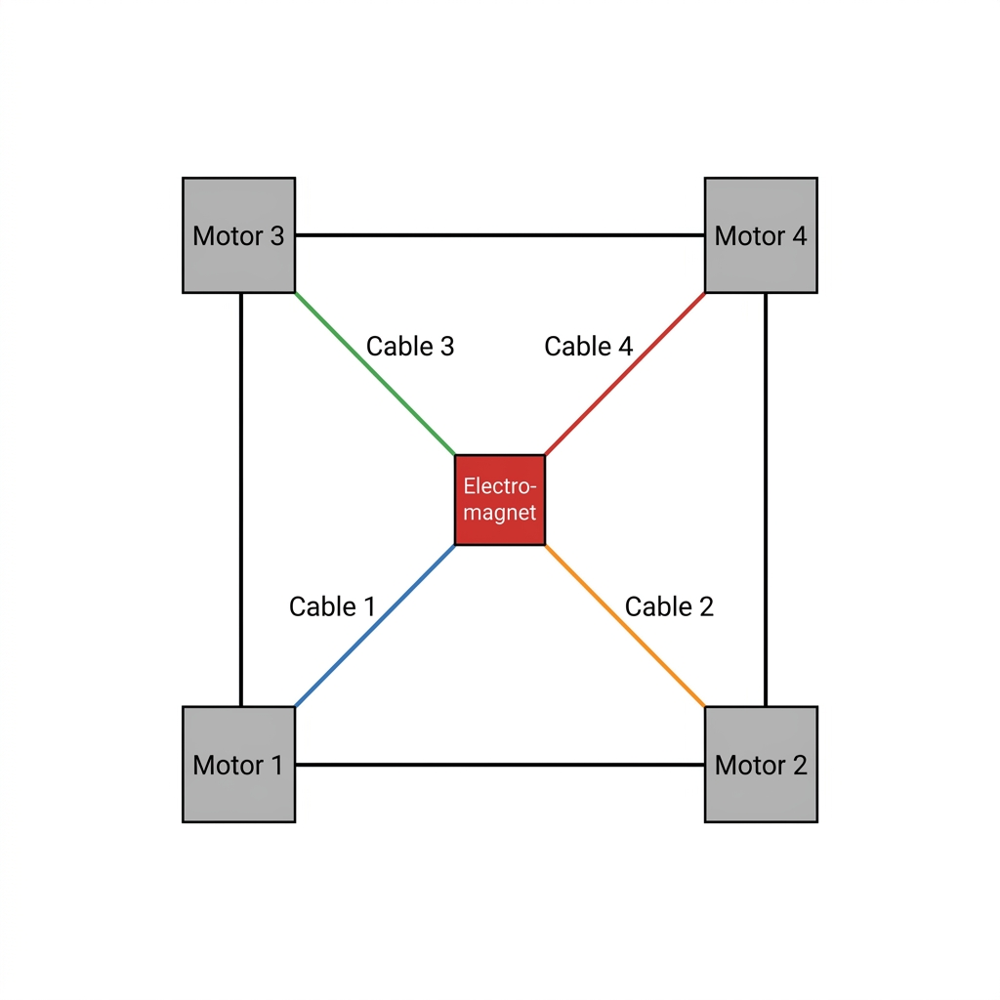

# Chess-Machine: 4-Axis Cable-Driven Chess Robot Control Engine

Welcome to the **Chess-Machine** repository. This project contains the core MicroPython firmware designed to run on a Raspberry Pi Pico to control a **4-axis cable-driven parallel manipulator (CDPM)**. The robot moves an electromagnet (end-effector) under a chessboard to manipulate magnetic chess pieces.



---

## 🚀 Key Features

* **Advanced Kinematics Engine:** Performs real-time mapping from 2D Cartesian board space to 4-axis cable lengths using the Pythagorean theorem.
* **Non-Linear Spool Compensation:** Models change in effective spool radius dynamically using a quadratic polynomial curve.
* **MicroPython Performance Optimization:**
  * **Jitter-Free Playback:** Uses `@micropython.native` decorators to compile critical motor stepping functions into native machine code.
  * **Math Pre-Calculation:** Pre-calculates heavy floating-point kinematics operations and encodes them into memory-efficient, bit-packed step sequences (`bytearrays`) to prevent micro-stuttering during real-time movement.
  * **Dynamic Memory Safety:** Implements segment-based buffering (`MultiLineMove`) to prevent out-of-memory errors on the Raspberry Pi Pico's memory-constrained environment.
  * **Garbage Collector Control:** Temporarily disables the garbage collector (`gc.disable()`) during critical computation segments to ensure steady step-pulse timing.
* **Asynchronous UART Interface:** Listens for movement and state requests over serial connections using a robust acknowledgment protocol.

---

## 📐 Kinematics & Mathematics

### 1. Coordinate Mapping
The chessboard coordinates are mapped from integer ranks and files (1 to 8) into physical space (mm) with a linear mapping function:

`Physical Position = 10 + (Coordinate - 1) * 28.71428`

### 2. Spool Winding Correction
As string wraps around a spool, the spool's effective radius increases. To ensure highly accurate positioning, the spool radius change is modeled using a quadratic relationship to translate cable length directly to stepper motor steps:

`Steps = A * (length^2) + B * length + C`

Where calibration coefficients are defined as:
* A = 0.0113142
* B = 16.9572
* C = -663.986

---

## 📂 Codebase Directory Structure

All microcontroller firmware files are located in the [pico/](file:///Users/james/Documents/chess/code/pico) directory:

| File Name | Description |
| :--- | :--- |
| 📄 [pico/main.py](file:///Users/james/Documents/chess/code/pico/main.py) | **Main Firmware Entrypoint.** Initializes the 4 motors and board coordinates, listens for UART commands, and coordinates move execution. |
| 📄 [pico/board.py](file:///Users/james/Documents/chess/code/pico/board.py) | **Board Controller.** Manages board state, maps logical steps, and controls motor enablement cycles during execution. |
| 📄 [pico/kinematics.py](file:///Users/james/Documents/chess/code/pico/kinematics.py) | **Kinematics Engine.** Contains equations for Cartesian-to-cable steps, path planning, and precalculated/segmented path buffers. |
| 📄 [pico/motor.py](file:///Users/james/Documents/chess/code/pico/motor.py) | **Stepper Motor Driver.** Controls H-bridge stepper winding power patterns and handles PWM-based holding current settings to prevent motor overheating. |
| 📄 [pico/debug.py](file:///Users/james/Documents/chess/code/pico/debug.py) | **Debug Tooling.** Functions to rotate, control, and test individual steppers interactively from the MicroPython REPL. |

---

## 🔌 Hardware Configurations

### Motor Layout & Pin Mapping
Each motor is driven by an H-bridge controller requiring 4 GPIO pins for stepper windings and 1 PWM pin for dynamic power/enable control:

```
Motor Layout
2 (Top-Left) ------ 3 (Top-Right)
     |                   |
     |                   |
0 (Bottom-Left) --- 1 (Bottom-Right)
```

| Motor ID | Position | Winding & Enable Pins | Invert Direction | Initial Steps |
| :---: | :--- | :--- | :---: | :--- |
| **Motor 0** | Bottom-Left | `GPIO 10, 7, 21, 9, 8` | Yes (`True`) | `0` |
| **Motor 1** | Bottom-Right | `GPIO 2, 3, 6, 4, 5` | No (`False`) | `3826` |
| **Motor 2** | Top-Left | `GPIO 20, 17, 18, 19, 16` | No (`False`) | `3826` |
| **Motor 3** | Top-Right | `GPIO 12, 11, 13, 14, 15` | No (`False`) | `5980` |

---

## 💬 UART Serial Protocol

Commands are received asynchronously over standard UART (baud rate: `9600`, TX: `GPIO 0`, RX: `GPIO 1`).

### 1. Get Current Position (`POS`)
* **Request:** `POS\n`
* **Response:** `POS(x,y)\r\n` (e.g. `POS(1,1)\r\n`)

### 2. Move to Waypoint Sequence (`MOV`)
Moves the electromagnet sequentially through one or more specified coordinate pairs.
* **Request:** `MOV(x1,y1,x2,y2,...)\n` (e.g., `MOV(1,1,1,2,2,2)\n`)
* **Flow:**
  1. **Acknowledge:** The system returns `ACK(x1,y1,x2,y2,...)\r\n` immediately.
  2. **Execute:** The kinematics engine plans and executes the move.
  3. **Done:** Upon arrival, the system returns `DONE(x1,y1,x2,y2,...)\r\n`.
  4. **Error/Failure:** If parameters are out-of-bounds (< 1 or > 8) or formatting is invalid, returns `NAK(params)\r\n`.

---

## 🛠️ Calibration & Diagnostics

You can interactively debug the stepper motors and spool windings using the MicroPython REPL.

1. Connect to the Raspberry Pi Pico via serial terminal (e.g. Thonny, Minicom, or Screen).
2. Stop the running program (`Ctrl+C`).
3. Import the debug package and test your motor:
   ```python
   from machine import Pin
   import motor
   import debug
   
   # Initialize a specific motor
   test_motor = motor.Motor(pins=[10, 7, 21, 9, 8], invertDirection=True)
   
   # Start the step troubleshooter (prompts for stepping via input)
   debug.stepFromREPL(test_motor, timePerStepUs=3000)
   ```

> [!WARNING]
> Always ensure motors are disabled when stationary. The `motor.py` driver turns off enable pins automatically after movement commands, preventing the H-bridges from drawing excessive current and overheating.
